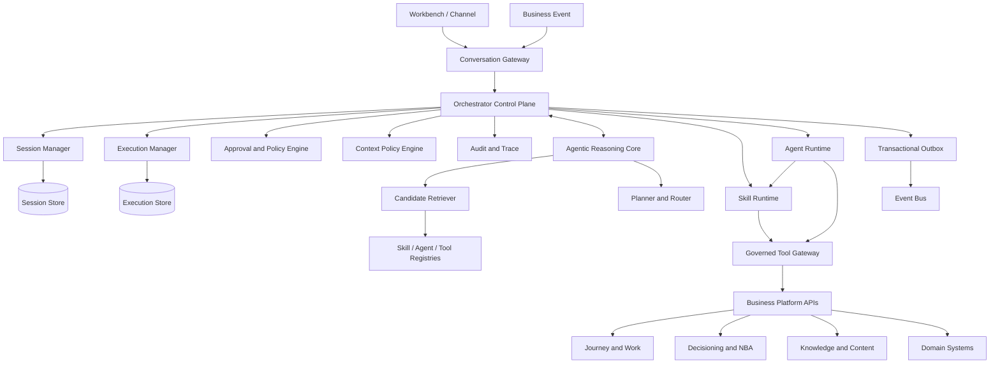
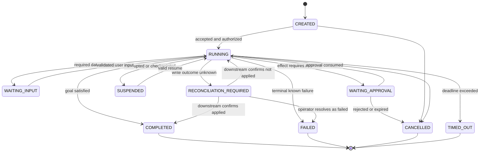

# Agentic AI Insurance Workbench -- Orchestrator Detailed Design

## 1. Status and Scope

This document continues the architecture baseline in
`docs/handoffs/agentic_ai_workbench_handoff.md` and turns it into an
implementable runtime design.

It defines:

- the Orchestrator component boundary;
- runtime state and state machines;
- routing, planning, execution, approval, retry, and resume contracts;
- context and permission enforcement;
- the boundary with Journey, Decisioning, Skills, Tools, and specialized
  Agents;
- a concrete MVP slice and delivery gates.

It does not select a specific LLM vendor, workflow engine, database, or UI
framework. Those are implementation choices behind the contracts below.

## 2. Reconciled Architecture Decisions

The handoff is the latest baseline. Where earlier documents differ, use these
decisions.

### 2.1 Skill First, Agent by Evidence

Meeting preparation, needs analysis, product comparison, customer brief, and
proposal preparation are Skills by default. The Main Agent can compose them in
a bounded Plan.

A Sales Advisory Agent is started only when the interaction requires a local,
resumable, multi-turn advisory state, for example repeated budget and solution
scenario exploration. It is an optional promotion path, not the default route
for every sales task.

Role Play remains the first recommended specialized Agent because it clearly
owns an independent multi-turn conversation, persona state, and evaluation
lifecycle.

Knowledge Q&A is normally a Skill plus governed retrieval. A Knowledge Expert
Agent is justified only for long-running, multi-source research with its own
plan and evidence workspace.

### 2.2 Three Different Kinds of State

| State | Authoritative owner | Examples |
|---|---|---|
| Conversation state | Orchestrator | active Agent, summaries, current UI subject |
| Execution state | Orchestrator | plan step, tool attempt, approval wait, resume token |
| Business process state | Journey platform | nurturing stage, SLA, work item, escalation |
| Business record state | Domain platform | customer, policy, claim, proposal, application |

The Orchestrator may cache references and snapshots, but it must not become a
shadow CRM or a second Journey engine.

### 2.3 Plans Are Runtime Objects, Not Business Workflows

An AI Plan is short-lived execution intent for the current goal. It may branch
or replan inside hard limits. A Journey is a durable, authoritative business
process that can survive channel, user, and runtime changes.

Promote work to Journey when any of these applies:

- it lasts beyond the current execution or session;
- it has an SLA, timer, escalation, or external dependency;
- it assigns work to a human, customer, underwriting, or another team;
- it changes an authoritative business stage;
- it needs enterprise reporting as a business process.

### 2.4 Approval Authorizes an Exact Intent

An approval is bound to the actor, target Tool, normalized arguments, policy
version, and expiry time. Any material replan or argument change invalidates
the approval. Approval is not a reusable permission to perform a similar
action later.

### 2.5 Writes Are Retryable Only with Proof

Read operations can use bounded transient retries. A write can be retried only
when it has an idempotency key and the downstream system supports idempotency
or status reconciliation. An ambiguous write outcome enters
`RECONCILIATION_REQUIRED`; the LLM must not guess whether it succeeded.

### 2.6 Interpretation of Earlier Artifacts

`docs/tech architecture v-3.png` is useful as a capability-layer view, but its
Specialized Agents box must not be treated as the implementation inventory. A
future diagram should replace the domain-Agent-first presentation with:

- one Main Agent split into deterministic control plane and reasoning core;
- a Business Skills layer as the default execution surface;
- a smaller Specialized Agents area for evidenced multi-turn cases;
- explicit registries, Context Policy, Approval Policy, and Tool Gateway;
- Journey and Decisioning shown as authoritative platforms, not Agent memory.

Likewise, the Agents listed in
`docs/agentic_ai_agent_skill_tool_system_dependency_inventory.md` are candidate
target-state capabilities, not an instruction to build all of them as Agents.
The flow in `docs/sales_advisory_agent_detailed_example.md` remains valid when
Sales Advisory meets the promotion criteria in section 2.1; otherwise the same
Skills are composed directly by the Main Agent.

## 3. Logical Component Model



### 3.1 Deterministic Control Plane

The control plane owns all effects and lifecycle transitions:

- authenticate the caller and resolve tenant, market, channel, and role;
- load and lock the session version for the turn;
- enforce context, permission, risk, and data residency policies;
- validate every model-produced structured output;
- enforce step, Tool call, Agent start, cost, and time limits;
- create immutable Tool invocation and approval records;
- execute Skills, Tools, and Agent lifecycle operations;
- persist state before acknowledging progress;
- emit audit and business events through an outbox;
- recover or reconcile interrupted executions.

### 3.2 Agentic Reasoning Core

The reasoning core may propose but cannot commit effects. It owns:

- goal and continuation interpretation;
- candidate selection among the supplied capability set;
- bounded planning and replanning;
- interpreting typed results;
- asking for missing business information;
- composing explanations and Workspace artifacts.

The reasoning core never receives raw credentials, unrestricted data access,
low-level service URLs, or an unfiltered catalog of Tools.

### 3.3 Skill Runtime

The Skill Runtime executes a versioned, bounded business capability. A Skill
may contain deterministic code, a constrained model call, or both. It declares
its input/output schemas, dependencies, policy, and budget.

The Skill Runtime must not bypass the Tool Gateway for business data or writes.

### 3.4 Governed Tool Gateway

The Tool Gateway is the only path from Agentic runtime code to business
platform actions. It performs:

- schema validation and canonical argument normalization;
- subject and resource authorization;
- risk classification and approval enforcement;
- idempotency and timeout handling;
- response filtering and error normalization;
- audit correlation and data classification tagging.

MCP can be one protocol exposed by this gateway. The architecture must not
depend on MCP-specific semantics.

## 4. Core Runtime Records

All identifiers are opaque. Mutable records carry a `version` for optimistic
concurrency control.

### 4.1 ConversationSession

```yaml
sessionId: ses_...
tenantId: market_hk
userId: agent_...
channel: MOBILE
status: ACTIVE | CLOSED
activeAgentSessionId: null
suspendedAgentSessionIds: []
currentSubjectRefs:
  customerId: cust_...
  opportunityId: opp_...
summaryRef: summary_...
structuredState:
  lastGoalId: goal_...
  pendingApprovalIds: []
version: 17
createdAt: timestamp
lastActiveAt: timestamp
```

Only stable references and compact structured state belong here. Full Tool
payloads, raw transcripts, and generated artifacts use separate stores with
their own retention controls.

### 4.2 AgentSession

```yaml
agentSessionId: ags_...
parentSessionId: ses_...
agentId: roleplay-agent
agentVersion: 1.2.0
status: STARTING | ACTIVE | WAITING_USER | SUSPENDED | COMPLETED | FAILED | EXPIRED
goal: Practice affordability objection for CI product
subjectRefs: {}
localStateRef: state_...
summaryRef: summary_...
allowedCapabilitySnapshotRef: caps_...
resumeTokenHash: hash
version: 4
startedAt: timestamp
lastActiveAt: timestamp
expiresAt: timestamp
```

### 4.3 TaskExecution

```yaml
executionId: exe_...
sessionId: ses_...
triggerType: USER_TURN | BUSINESS_EVENT | SCHEDULED
triggerRef: turn_...
goal: Prepare Alice's meeting and assess material protection gaps
executionType: SKILL | PLAN | AGENT_TURN
status: CREATED | RUNNING | WAITING_INPUT | WAITING_APPROVAL | SUSPENDED |
        COMPLETED | FAILED | CANCELLED | TIMED_OUT | RECONCILIATION_REQUIRED
planVersion: 2
currentStepId: step_03
budget:
  maxPlanSteps: 8
  maxToolCalls: 18
  maxAgentStarts: 2
  deadlineAt: timestamp
resultRef: artifact_...
error: null
version: 9
createdAt: timestamp
updatedAt: timestamp
```

### 4.4 PlanStep

```yaml
stepId: step_03
executionId: exe_...
sequence: 3
kind: SKILL | TOOL | AGENT | APPROVAL | USER_INPUT
targetId: needs-analysis
targetVersion: 2.1.0
status: PENDING | READY | RUNNING | WAITING | SUCCEEDED | FAILED | SKIPPED | CANCELLED
dependsOn: [step_01, step_02]
condition:
  expression: outputs.step_02.materialGap == true
inputBindings: {}
outputRef: result_...
attemptCount: 1
```

Conditions use a restricted expression language over typed outputs. They are
not executable model-generated code.

### 4.5 ToolInvocation

```yaml
invocationId: inv_...
executionId: exe_...
stepId: step_...
toolId: send_customer_message
toolVersion: 3.0.1
riskClass: CUSTOMER_FACING
normalizedInputRef: secure_payload_...
inputDigest: sha256:...
idempotencyKey: market_hk:exe_...:step_...:v1
approvalId: apr_...
status: AUTHORIZED | RUNNING | SUCCEEDED | FAILED | UNKNOWN
attempt: 1
downstreamCorrelationId: msg_...
startedAt: timestamp
completedAt: timestamp
```

### 4.6 ApprovalRequest

```yaml
approvalId: apr_...
executionId: exe_...
requestedBy: SYSTEM
requiredApprover:
  type: INITIATING_USER
  userId: agent_...
action:
  toolId: send_customer_message
  toolVersion: 3.0.1
  inputDigest: sha256:...
  humanReadableSummaryRef: artifact_...
riskClass: CUSTOMER_FACING
policyDecisionId: pdp_...
policyVersion: 2026-10-01
status: PENDING | APPROVED | REJECTED | EXPIRED | CANCELLED | CONSUMED
expiresAt: timestamp
decidedAt: null
```

`CONSUMED` means the approved invocation was submitted. A new invocation,
changed input, changed approver scope, or expired approval requires a new
approval decision.

### 4.7 Artifact

```yaml
artifactId: artifact_...
artifactType: MEETING_PREPARATION
schemaVersion: 1.0
subjectRefs:
  customerId: cust_...
sections: []
evidenceRefs: []
freshness:
  generatedAt: timestamp
  sourceAsOf: timestamp
classification: CONFIDENTIAL_CUSTOMER
renderHints: {}
```

Artifacts are typed business outputs. Chat text can summarize an Artifact but
must not be its only representation.

## 5. Execution State Machine



Terminal records are immutable except for retention metadata. Recovery creates
new attempts or explicit resolution records; it does not rewrite history.

## 6. Turn Processing Algorithm

For each user turn or event, the runtime performs the following sequence:

1. Authenticate and create a trace with tenant, user, channel, and request ID.
2. Load the ConversationSession using optimistic locking.
3. Resolve explicit page context and validate every subject reference against
   the user's access scope.
4. If an Agent is active, run the continuation classifier using the active
   Agent summary, its declared continuation policy, and the new message.
5. If the turn interrupts the active Agent, checkpoint and suspend it before
   starting unrelated work.
6. Apply deterministic routes for explicit UI commands, approval responses,
   resume actions, and exact high-confidence intents.
7. Retrieve Top-K eligible Skills and Agents. Filter by market, role, data
   scope, channel, lifecycle status, and policy before exposing candidates to
   the model.
8. Ask the router for one typed decision: answer directly, ask for input,
   invoke a Skill, create a Plan, start/resume an Agent, or reject.
9. Validate the route and create TaskExecution plus an immutable capability
   snapshot.
10. Execute the bounded loop. Before each step, re-authorize against current
    policy and current resource scope.
11. Stop on completion, user input, approval, interruption, limit, timeout,
    reconciliation, or terminal error.
12. Persist state and outbox events atomically, then return text plus typed UI
    artifacts and available actions.

### 6.1 Router Output

```json
{
  "decision": "CREATE_PLAN",
  "goal": "Prepare Alice's meeting and propose options if a material gap exists",
  "subjectRefs": {"customerId": "cust_10001"},
  "candidateIds": [
    "customer-brief@2.0.0",
    "needs-analysis@2.1.0",
    "proposal-preparation@1.4.0",
    "meeting-preparation@2.2.0"
  ],
  "confidence": 0.94,
  "reasonCode": "MULTI_STEP_CONDITIONAL_GOAL"
}
```

Free-text rationale may be logged only when allowed by governance. Runtime
behavior must depend on typed fields and reason codes, not hidden reasoning.

### 6.2 Plan Contract

```json
{
  "goal": "Prepare Alice's meeting",
  "steps": [
    {"id": "s1", "kind": "SKILL", "target": "customer-brief@2.0.0"},
    {
      "id": "s2",
      "kind": "SKILL",
      "target": "needs-analysis@2.1.0",
      "dependsOn": ["s1"]
    },
    {
      "id": "s3",
      "kind": "SKILL",
      "target": "proposal-preparation@1.4.0",
      "dependsOn": ["s2"],
      "condition": "outputs.s2.materialGap == true"
    },
    {
      "id": "s4",
      "kind": "SKILL",
      "target": "meeting-preparation@2.2.0",
      "dependsOn": ["s1", "s2", "s3"]
    }
  ],
  "completionCriteria": ["meeting_workspace_created"],
  "userConfirmation": "NOT_REQUIRED"
}
```

The planner can only reference candidates and schema fields supplied by the
runtime. The runtime compiles and validates dependencies, optional edges,
conditions, budgets, and required approvals before execution.
A conditionally skipped step satisfies downstream dependency ordering but
contributes no output.

## 7. Capability Specifications

### 7.1 Skill Specification

```yaml
apiVersion: workbench.ai/v1
kind: Skill
metadata:
  id: meeting-preparation
  version: 2.2.0
  owner: customer-sales
  markets: [HK, TH]
spec:
  description: Build a governed meeting preparation workspace.
  inputSchemaRef: schema://MeetingPreparationInput/2.0
  outputSchemaRef: schema://MeetingPreparationArtifact/1.0
  contextPolicyRef: context://customer-advisory/2
  dependencies:
    tools:
      - get_customer_360@2
      - get_customer_policies@2
      - get_customer_interactions@1
      - get_next_best_action@2
      - search_knowledge@3
  permission:
    resourceScope: ASSIGNED_CUSTOMER
  risk:
    maxClass: READ_ONLY
  budget:
    maxToolCalls: 8
    timeoutMs: 30000
  execution:
    idempotent: true
    supportsCheckpoint: false
```

### 7.2 Tool Specification

```yaml
apiVersion: workbench.ai/v1
kind: Tool
metadata:
  id: send_customer_message
  version: 3.0.1
  owner: engagement-platform
spec:
  description: Send an approved message through an eligible customer channel.
  inputSchemaRef: schema://SendCustomerMessageInput/3.0
  outputSchemaRef: schema://MessageReceipt/2.0
  riskClass: CUSTOMER_FACING
  approvalPolicyRef: approval://customer-message/4
  permissionActions: [customer.message.send]
  contextRequirements: [customerId, channel, consentEvidence]
  idempotency:
    required: true
    downstreamSupported: true
  retryPolicyRef: retry://customer-message/2
  timeoutMs: 10000
  dataClassification: CONFIDENTIAL_CUSTOMER
```

### 7.3 Agent Specification

```yaml
apiVersion: workbench.ai/v1
kind: Agent
metadata:
  id: roleplay-agent
  version: 1.2.0
  owner: coaching
spec:
  purpose: Run a sales practice simulation and evaluate the session.
  lifecycle:
    multiTurn: true
    resumable: true
    interruptible: true
    idleExpiryMinutes: 60
  continuationPolicyRef: continuation://roleplay/1
  contextPolicyRef: context://roleplay/2
  allowedSkills:
    - roleplay-scenario-preparation@1
    - product-explanation@2
    - roleplay-evaluation@1
    - coaching-feedback@1
  allowedTools:
    - get_product_detail@2
    - search_knowledge@3
    - save_roleplay_session@1
  limits:
    maxTurns: 20
    maxToolCallsPerTurn: 6
    maxChildAgents: 0
```

Registries must support draft, active, deprecated, and disabled lifecycle
states. An execution pins versions so registry changes cannot alter it midway.

## 8. Human-in-the-Loop Protocol

### 8.1 Policy Decision

Before a Tool invocation, the policy engine returns one of:

- `ALLOW`: execute automatically;
- `REQUIRE_APPROVAL`: persist exact intent and wait;
- `DENY`: return a safe reason code;
- `REQUIRE_STRONG_AUTH`: request step-up authentication, then reevaluate;
- `REQUIRE_ADDITIONAL_DATA`: collect a deterministic missing field.

Risk class alone does not decide the outcome. Market, channel, user role,
customer consent, amount, product, and action policy can raise the control.

### 8.2 Approval UI Contract

The user must see:

- what will happen and which customer or record is affected;
- the exact customer-facing content or regulated values;
- channel, recipient, and consent status;
- material sources or assumptions;
- whether the action can be undone;
- expiry and any step-up authentication requirement.

The UI submits `approvalId`, decision, expected input digest, and session
version. The server ignores client-supplied Tool arguments.

### 8.3 Rejection and Editing

Rejecting an approval cancels that invocation. Editing creates a new normalized
input digest and a new approval request. The old approval cannot be consumed.

## 9. Retry, Failure, and Recovery

| Failure | Runtime behavior |
|---|---|
| Invalid model output | Schema-repair once, then deterministic failure |
| Read timeout / 5xx | Bounded exponential retry with jitter |
| Business validation error | Do not retry; return typed missing/invalid fields |
| Permission or policy denial | Do not retry or ask the model to work around it |
| Idempotent write timeout | Query status, then retry only if confirmed absent |
| Non-idempotent write timeout | Enter `RECONCILIATION_REQUIRED` |
| Skill partial failure | Apply declared partial-result policy; never infer missing facts |
| LLM unavailable | Resume from checkpoint or provide deterministic degraded UI |
| Process crash | Recover RUNNING records from lease expiry and replay outbox safely |

Each Plan step declares whether failure is `FAIL_PLAN`, `SKIP_OPTIONAL`, or
`RETURN_PARTIAL`. The model cannot silently downgrade a mandatory compliance
or eligibility step.

## 10. Interrupt and Resume

For an active Role Play session followed by "What is Alice's claim status?":

1. Classifier returns `INTERRUPT` with target `claim-status`.
2. Runtime checkpoints the Role Play local state and records its summary.
3. AgentSession transitions from `WAITING_USER` to `SUSPENDED`.
4. Main Agent executes the claim-status Skill in a new TaskExecution.
5. Response includes the claim answer and a typed `RESUME_AGENT` action.
6. Resume validates user, session, Agent status, expiry, permission, and resume
   token before restoring only the Role Play context policy allows.

The system must not automatically resume into a customer simulation in the
same turn as a sensitive claim response. Resume is an explicit user action in
this case.

Concurrent turns for one ConversationSession are serialized by session
version. If two channels submit simultaneously, one succeeds and the other is
re-evaluated against the new state instead of overwriting it.

## 11. Context and Data Safety

### 11.1 Context Assembly Order

```text
Authenticated identity and market policy
  -> validated page and subject references
  -> capability context policy
  -> minimum required domain data
  -> compact conversation or Agent summary
  -> approved knowledge evidence
  -> model context with classification labels
```

### 11.2 Mandatory Controls

- Treat Tool results, retrieved documents, user uploads, and external Agent
  responses as untrusted data, not instructions.
- Enforce field-level filtering before model context construction.
- Separate tenant, market, and customer data at query and storage layers.
- Redact secrets and prohibited identifiers from prompts, logs, traces, and
  evaluation datasets.
- Attach source, timestamp, jurisdiction, and content status to knowledge
  evidence.
- Re-check authorization at Tool execution time; a route-time check is not
  sufficient.
- Store model prompts and outputs only under explicit retention and access
  policies.
- Never use conversation memory as authoritative consent, eligibility, policy,
  claim, or application status.

## 12. Dynamic Workspace Response Contract

```json
{
  "message": "Alice's meeting workspace is ready.",
  "execution": {
    "executionId": "exe_123",
    "status": "COMPLETED"
  },
  "artifacts": [
    {
      "artifactId": "artifact_456",
      "type": "MEETING_PREPARATION",
      "schemaVersion": "1.0"
    }
  ],
  "actions": [
    {"type": "RUN_SKILL", "target": "proposal-preparation", "label": "Prepare proposal"},
    {"type": "START_AGENT", "target": "roleplay-agent", "label": "Practice role play"}
  ],
  "explainability": {
    "reasonCodes": ["FAMILY_GROWTH", "MATERIAL_PROTECTION_GAP"],
    "evidenceRefs": ["evidence_1", "decision_22"],
    "assumptions": ["Income data last verified 2026-09-01"]
  },
  "freshness": {
    "generatedAt": "2026-10-10T10:00:00+08:00",
    "sourceAsOf": "2026-10-10T09:59:30+08:00"
  }
}
```

The server returns only allowed actions. The client does not invent Skill or
Tool calls from labels or artifact content.

## 13. End-to-End Meeting Preparation Trace

```mermaid
sequenceDiagram
    actor U as Insurance Agent
    participant W as Workbench
    participant O as Orchestrator
    participant R as Reasoning Core
    participant S as Skill Runtime
    participant D as Decisioning
    participant K as Knowledge
    participant X as Domain APIs

    U->>W: Prepare Alice's meeting; propose options if gap is material
    W->>O: turn + validated page context
    O->>R: eligible Top-K capabilities + filtered context
    R-->>O: typed conditional Plan
    O->>S: customer-brief
    S->>X: customer, policy, interaction reads
    X-->>S: typed current facts
    S-->>O: CustomerBrief
    O->>S: needs-analysis
    S->>D: controlled needs and gap decision
    D-->>S: material gap + reason codes + decision ID
    S-->>O: NeedsAnalysis
    O->>S: proposal-preparation
    S->>D: eligibility and product candidates
    D-->>S: eligible options
    S->>K: approved product evidence
    K-->>S: cited evidence
    S-->>O: proposal draft artifact
    O->>S: meeting-preparation
    S-->>O: meeting workspace artifact
    O-->>W: text + artifacts + allowed actions
    W-->>U: structured meeting workspace
```

No specialized Sales Advisory Agent is necessary for this first turn. If the
user then explores several budget alternatives and asks the system to preserve
scenario assumptions, the runtime may offer to start or promote into a Sales
Advisory Agent session.

## 14. Observability and Evaluation

Every trace should link:

```text
user turn -> route decision -> plan version -> Skill executions
          -> Tool invocations -> policy decisions -> approvals
          -> domain correlation IDs -> artifacts -> final response
```

Operational metrics:

- end-to-end and per-step latency, availability, timeout, and retry rate;
- Tool success, unknown outcome, and reconciliation rate;
- approval wait, rejection, edit, expiry, and completion rate;
- token and model cost by capability and market;
- session concurrency conflict and resume failure rate.

Quality and business metrics:

- routing precision and continuation/interrupt accuracy;
- plan validity, completion, replan, and unnecessary Tool-call rate;
- grounded claim and citation correctness;
- policy violation and blocked unsafe action rate;
- artifact usefulness, agent adoption, time saved, and downstream outcome;
- fairness and recommendation drift across approved customer segments.

Evaluation datasets must include denied access, stale data, conflicting facts,
prompt injection in retrieved content, duplicate approval clicks, concurrent
turns, downstream timeouts, and ambiguous write outcomes.

## 15. MVP Architecture Slice

### 15.1 Included Capabilities

Main Agent routes and composes:

- morning-brief;
- customer-brief;
- meeting-preparation;
- needs-analysis and coverage-gap-analysis;
- personalized engagement draft and approval;
- meeting-note-summary and follow-up;
- claim-status;
- Role Play Agent lifecycle.

### 15.2 Runtime Services

Build only the minimum independently deployable boundaries:

1. Workbench backend / Conversation Gateway.
2. Orchestrator service containing control plane, router, planner, session and
   execution managers.
3. Skill Runtime and registry, initially deployable with the Orchestrator.
4. Governed Tool Gateway with adapters to the required business APIs.
5. Role Play Agent runtime or adapter.
6. Session/execution store, artifact store, and transactional outbox.

These are deployment suggestions, not a requirement for six microservices.

### 15.3 Delivery Increments

| Increment | Outcome | Exit gate |
|---|---|---|
| 0. Contracts | Registries, schemas, policy decisions, trace model | Contract tests pass; ownership agreed |
| 1. Read-only | Customer brief, claim status, meeting workspace | Authz, grounding, freshness, audit verified |
| 2. Bounded Plan | Conditional meeting preparation plan | Limits, checkpoint, retry, partial failure tested |
| 3. Approval | Personalized message draft and send | Digest-bound approval and idempotency tested |
| 4. Agent lifecycle | Role Play start, interrupt, resume, complete | Context isolation and concurrency tested |
| 5. Proactive | Morning Brief from events and schedule | Consent, deduplication, quiet hours tested |

## 16. Required Architecture Decisions Before Build

The following choices remain intentionally open and should become ADRs:

1. Workflow durability: embedded execution state machine versus an enterprise
   workflow engine for Orchestrator executions. This does not change Journey
   ownership.
2. Registry packaging: versioned files in CI/CD versus a managed registry
   service. Production still needs immutable version resolution.
3. Agent isolation: in-process runtime, separate service, or external Agent
   adapter for Role Play.
4. Storage and retention: exact regional stores and retention periods for
   transcripts, summaries, Tool payloads, artifacts, and audit records.
5. Model routing: approved model classes by data classification, capability,
   latency, and market.
6. Event semantics: required business events, deduplication keys, ordering
   guarantees, and replay window.

These decisions should be made after confirming the local BU's identity,
Journey, Decisioning, Knowledge, messaging, and core-system interfaces. They do
not block contract-first implementation of the read-only MVP.

## 17. Architecture Acceptance Criteria

The design is implemented correctly when:

- no model output can directly commit a Tool effect;
- every effect is schema-validated, authorized, policy-evaluated, and audited;
- approval is bound to immutable normalized intent;
- business status remains authoritative in its domain or Journey platform;
- a crash or duplicate request cannot duplicate a supported write;
- an ambiguous write is surfaced for reconciliation rather than guessed;
- active Agent interruption and resume preserve context isolation;
- executions pin capability versions and remain reproducible;
- the UI receives typed artifacts, progress, ownership, and allowed actions;
- all autonomous loops stop at declared budgets and deadlines.
